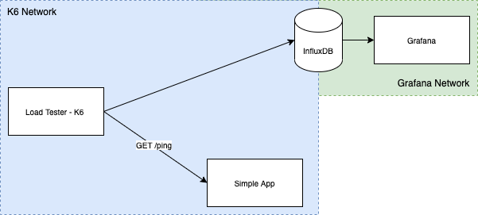

# traffic-generator

This project is used to generate traffic in a test application.



## Pre-reqs:

- Docker desktop

## Quick start

To build your local envronment is very easy.

### Step 1 - Jump to project folder

```cd traffic-generator```

### Step 2 - Launch influxdb and grafana containers

```docker-compose up -d influxdb grafana app```

### Step 3 - Uhuu, Now run a test example

```docker-compose run k6 run /scripts/load.js```

You have test results access in Grafana Dashboard: ```http://localhost:3000/d/k6/k6-load-testing-results?orgId=1&refresh=5s```

## You rock

Now you have freedom for customize others test plans.

Ref.: https://k6.io/docs/getting-started/running-k6/ 